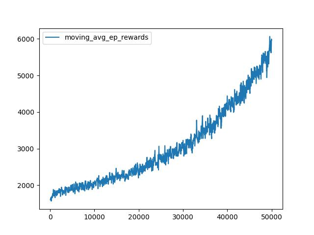

# PytorchMario
## An updated version of the Mario RL tutorial from pytorch.

This is an update of the pytorch tutorial to create a RL model for Super Mario Bros with a few notable changes
* It does NOT use simplified block mario (I feel this cheats at the real task of playing mario by RL, although you could argue it's a filter you could create on the image data, but that only holds as long as sprites stay consistent)
* Uses native resolution instead of resize to 84x84 (lack of guarentee of how resize is going to treat small sprites)
* Uses full color instead of greyscale & Conv3D layers
* Moved axis on Env state to correct shape for Conv3D layers
* Adjusted rewards in last frames before loss to account for creating unwinnable situations (e.g. falling into a pit)
* Setup for modern CUDA based environments
* Adds additional default movements to action space including run and backward movement
* Uses a probability distribution when determining random movement (e.g. forward movements set to be more likely than backward)
* Updates the cache in batch every episode to prevent large slowdown from frequency of HDD writes
* Significant code cleanup and updates to be more consistent with current Pytorch standards
* Updated cache and rewards to better account for lost lives (Mario is mostly deterministic, if one life failed to complete the stage with the model the next will as well)
* Increased rewards on level completion based on total actions to complete level and allows progression to next stage.


## Installation:
> [!IMPORTANT]
> nes-py requires visual C++ build tools

` python -m venv .`
` ./Scripts/Activate `
` pip install -r requirments.txt `

## Config:
` Edit config.py for all basic parameters `

## Training:
` python mario.py `

## Running Trained Agent:
Note: you need to train the agent first
` python mario.py --play`

## Other command line options:
```
  --visualize #Turns on the gamplay visuals
  --no_log #Disables logging
  --num_episodes #Shortcut to override config number of episodes
```

## Performance
With 50k episodes trained with mario starting on 1-1 and being able to continue to the next stage the average reward approaches 6k.  This is equivelent to mario often progressing to stage 1-3.



Training time for 50k episodes was nearly a week with a GeForce 2080 Super.  GPU memory usage when training is nearly 20GB including shared.

![resource utilization from task manager] (resource_util.jpg)
